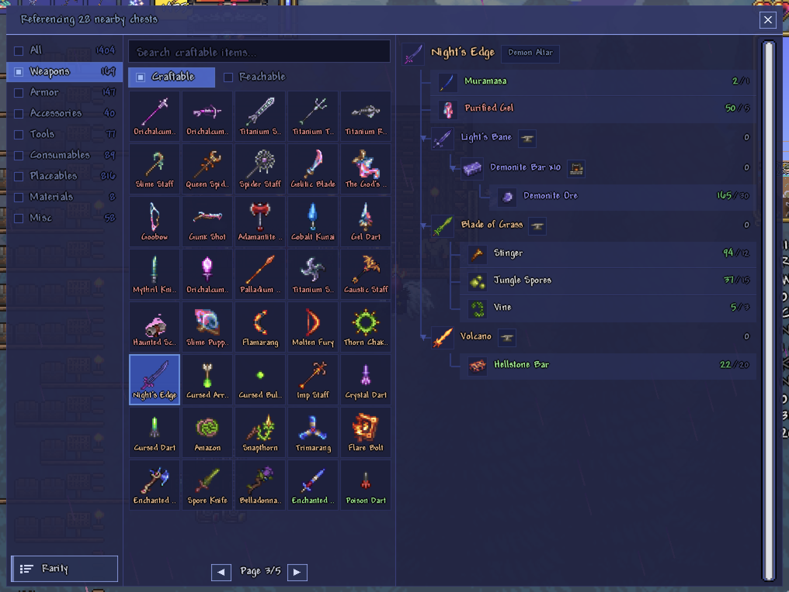

# Steroid Guide

A smarter Guide NPC for Terraria. Instead of checking recipes one item at a time, Steroid Guide scans your entire inventory and nearby chests to show you every top-tier item you can craft — including multi-step recipes.

## The NPC

Steroid Guide is a passive town NPC that spawns when a valid house is available. Talk to him and click **"Craftable"** to open the craftable items UI.

## Features

- **Recursive recipe analysis** — Traces full crafting chains automatically (with cycle detection for self-referential recipes). If you have the raw materials for a Night's Edge — even across multiple intermediate crafts — it tells you.
- **Two craftability axes** — Switch between *Craftable* (you can craft it right now) and *Reachable* (you have every ingredient type but lack the quantity).
- **Top-tier item filtering** — Only shows final products, not intermediate steps. If Light's Bane is just a stepping stone to Night's Edge, only Night's Edge appears.
- **Inventory + chest scanning** — Reads your inventory and all chests within range.
- **Category filters** — Filter results by Weapons, Armor, Accessories, Tools, Consumables, Placeables, Materials, or Misc.
- **Search & sort** — Find items by name or by ingredient name; sort by rarity or name.
- **Recipe tree viewer** — Click any item to see its full crafting tree with required stations (Demon Altar, Mythril Anvil, etc.) and per-material owned counts.
- **Universal mod support** — Works with any mod's recipes (Calamity, Thorium, etc.) since it reads from `Main.recipe` at runtime.

## How It Works

1. **Graph build** (once on mod load) — Builds a directed graph from all registered recipes. Nodes are items, edges are "is material for" relationships. Self-referential recipes are handled via cycle detection.
2. **Item scan** (on UI open / inventory change) — Aggregates items from player inventory + nearby chests into an `itemID → quantity` map.
3. **Recursive search** — For each item in the game, determines if it's craftable from available materials (directly owned or recursively craftable). Uses memoization and cycle detection.
4. **Top-tier filter** — From all craftable items, removes any that serve as materials for another craftable item. The remainder are your "best possible" crafts.

Recalculation only triggers when inventory or visible chests actually change.

## Installation

Requires [tModLoader](https://github.com/tModLoader/tModLoader) (net8.0).

Place the mod folder in `tModLoader/Mods/` or build from source.

## Compatibility

- Terraria 1.4.4+ with tModLoader
- .NET 8.0
- Compatible with all content mods — no hardcoded recipes
